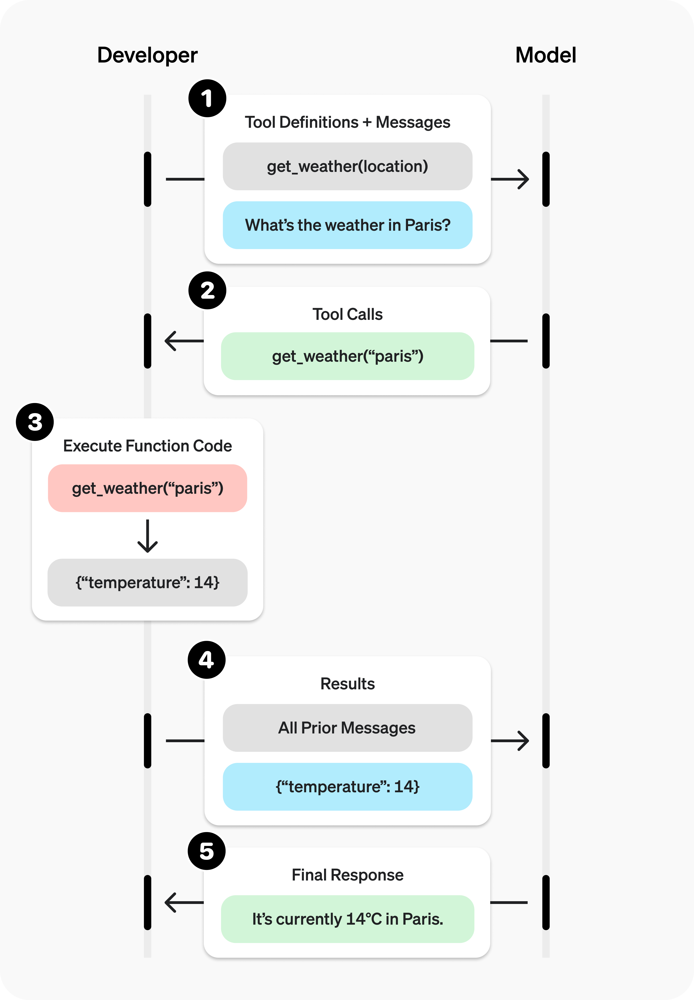

# HW1h Write-up

## How I completed the required tasks
- I watched Elder Gong's video titled: "Faith, Dignity, and Human Flourishing: Hearing God’s Voice in an Age of Artificial Intelligence"
- I reflected on the decisions I am willing to let agents make and what decisions I am not willing to let it make. My responses are as follows below:
    * I will always strive to use AI as a tool. Thus, I am willing to let it make decisions such as:
        - Decisions that come from a thought partner
        - Decisions that have little to no eternal significance
        - Minor, miniscule decisions
        - Menial, repetitive decisions
        - Decisions that I feel I do not need to trifle with or worry about
        - Decisions for which I will not need to feel accountable in case things go poorly. 
    * I will not let agents take away my agency or remove the righteous ability to work. Thus, I will not let it make decisions such as: 
        - Large company decisions
        - Decisions where someone's life is at stake
        - Major life decisions, like who to marry
        - Decisions relating to God or divine authority or guidance
        - Decisions that are heavily morally ambiguous
        - Decisions that carry significant weight in terms of their societal or economic impact

## Additional exploration
- I read many of the comments under Elder Gong's video about what he said. Many are very pleased with the spiritual-backed understanding of AI that Elder Gong offered. One even described the video as a "breath of fresh air." Many described it as true. 
- I continued watching different videos about divine truth, like this one by Elder Soares: (https://www.youtube.com/watch?v=8JlONwbaXsg&pp=0gcJCTUMAYcqIYzv). 
    * From this video by Elder Soares, I was reminded that the Spirit will guide us in a world full of confusion and commotion. As long as I strive to live worthily, I can be guided by Him. 
- I read OpenAIs documentation about functio (or tool) calling. The link is here: https://developers.openai.com/api/docs/guides/function-calling?utm_source=chatgpt.com&api-mode=responses

## Obstacles I encountered
- I wrestled with the fact that many people use AI improperly, allowing it to become a stumbling block in their righteous pursuits. For example, many go to AI for an emotional connection or for divine guidance, which are morally wrong uses of AI. 
- An obstacle I encountered is the desire to use AI in a way that will inhibit my righteous learning through righteous work. For example, I will sometimes catch myself thinking it would be much easier if I could have AI write a talk for me or do my homework for me. However, this is wrong, and I should never use AI to circumvent righteous work and do things that the Lord would disapprove of. 

## What I learned
- I learned that AI has a large impact on our relationships and that our proper use of AI will determine the connections we form. Our use of AI has a large impact on our spirits.
- I learned that AI can never replace revelation or generate truth from God. It can never make covenants or be alive. God made man. Man made AI, but AI can never be God. 
- I also learned that, in a world dominated by screens and technology, it is important to be in touch with the world that God has created. It is also more important than ever to be in touch with God Himself and His children around us. 
- I learned that my voice will always be unique and special. I have a way of writing and communicating thoughts that AI will have a very difficult time (if ever possible) replicating. Thus, it is important to use this voice in works that I claim as mine, especially in communication to other people. 
- I learned more about the process of tool-calling and what happens behind the scenes, as shown in this photo: 

## Why this matters in the context of agent engineering
In the context of agent engineering, it is extremely important to keep in mind the signficant impact that AI can have on the world around us and even ourselves. If we let them, agents can negatively or positively influence our relationships and connections. When used properly, they can help us be more efficient and productive towards our goals and aspirations. When used improperly, they can become a great distraction and stumbling block. 

When creating agents, it is so important to remember where they fall in the line of divine intelligence, human intelligence, and artificial intelligence. AI can never be like God, nor will it ever have a soul. Thus, it should be viewed as a tool, or a means of helping humankind. It should never be more than that. This matters because having a correct understanding of agents and their role in the world God has created will ensure they are used for righteous, morally good purposes.

## How many hours I spent
I spent 3 hours on this homework. 